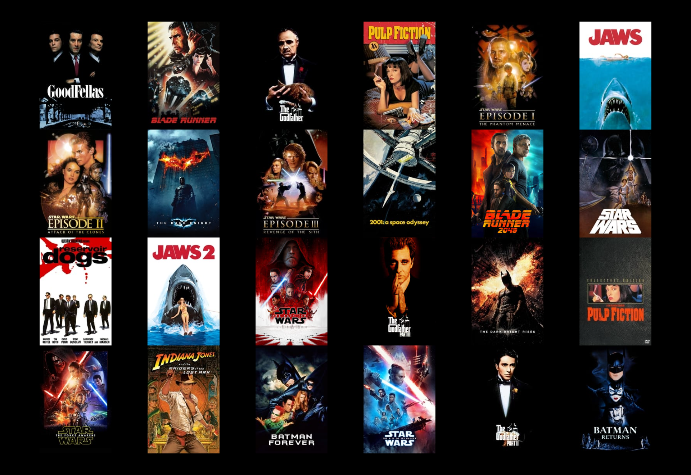

# The Movie App 

Movie API App

## Goal:

    Was to build the server-side component of a “movies”
    web application.
    The web application will provide users with access
    to information about different movies, directors,
    and genres.
    Users will be able to sign up, update their personal
    information, and create a list of their favorite
    movies.

## Description

    The Movie App is a single-page application (SPA) built using React, React Bootstrap, React Router, Redux, and Bootstrap. It showcases curated film content. The application allows users to view a list of movies, search for movies by title, view details about individual movies, and save movies to thier Favorites. Profile updates and user authentication are also part of this app. The application is responsive and mobile-friendly. JWT tokens are used for user authentication and authorization along with password hashing for security on the backend.

## Accessing the Hosted Site

    The Movie App is now hosted and accessible online. You can visit the site at: https://

## Prerequisites

    Before you begin, ensure you have met the following requirements:

    - Node.js installed on your local machine.
    - npm (Node Package Manager)

## Technologies Used

    - React: A JavaScript library for building user interfaces.
    - React Bootstrap: A front-end framework built on top of Bootstrap for React components.
    - React Router: A routing library for React that enables navigation between different components.
    - Redux: A Predictable State Container for JS Apps

    ### Main Components

- **MainView**: Is the entry point, orchestrating navigation and rendering of different views.
- **NavigationBar**: Provides navigation based on user authentication status.
- **MovieView**: Displays detailed information about movies.
- **MovieCard**: Represents a single movie selected by the user, showing details and allowing users to mark the movie as one of thier favorites.
- **SignupView & LoginView**: Handles user registration and authentication.
- **ProfileView**: Allows users to view and edit their profile, manage favorite movies, change passwords, and delete accounts.
- **MovieList**: Renders a list of movies, incorporating filtering functionality through **MovieFilter**.

### Redux Setup

    The application leverages Redux Toolkit for state management, with slices for user authentication (`user`) and movie data (`movies`). It employs asynchronous thunks for user interactions with the backend API, managing application state efficiently.

## API

The Movie App interacts with a custom movie API available at [Movie-API](https://github.com/Vanuck/The-Movie-App). The API supplies data about movies, including titles, descriptions, genres, directors, authors, famous lines, and more. Please refer to the API documentation for more details on available endpoints and data formats.

## Dependencies

    -@fortawesome/free-solid-svg-icons: ^6.5.1
    -@reduxjs/toolkit: ^2.2.1
    -bootstrap: ^5.3.3
    -cors: ^2.8.5
    -express: ^4.18.3
    -express-validator: ^7.0.1
    -prop-types: ^15.8.1
    -react: ^18.2.0
    -react-bootstrap: ^2.5.0
    -react-dom: ^18.2.0
    -react-icons: ^5.0.1
    -react-redux: ^9.1.0
    -react-router: ^6.22.1
    -react-router-dom: ^6.22.1
    -react-scripts: ^5.0.1
    -redux: ^5.0.1
    -redux-devtools-extension: ^2.13.9
    -redux-thunk: ^3.1.0

## DevDependencies:

    -@parcel/transformer-sass: ^2.11.0
    -parcel: ^2.11.0
    -process: ^0.11.10

## Testing with Parcel

If you prefer to test the project locally, follow these steps:

1. Install Parcel globally if you haven't already:
   ```
   npm install -g parcel
   ```
2. Run the following command to start the development server:
   ```
   parcel src/index.html
   ```
3. Open your browser and navigate to `http://localhost:1234/` to view the site.

## Contributing

Contributions are welcome! Please fork the repository and create a pull request with your proposed changes.

## License

This project is licensed under the terms of the [ISC License](https://opensource.org/licenses/ISC).
